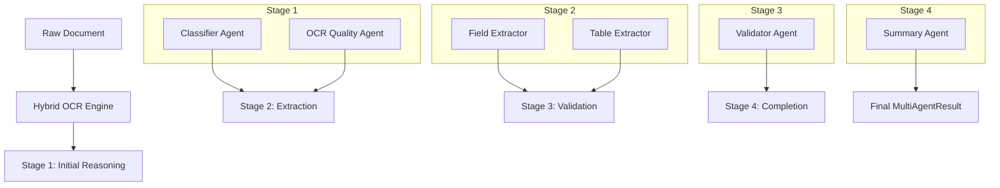

# 🧠 Document AI Backend: Specialist Agent Architecture

The backend is built with **FastAPI** and serves as the intelligence layer of the application. It orchestrates a multi-staged, multi-agent pipeline to transform raw documents into high-fidelity structured data.

---

## 🏗️ Architecture Overview

The system follows a **Specialist-Orchestrator** pattern. Instead of a single monolithic LLM call, the workflow is distributed across specialized "Micro-Agents" that reason about specific aspects of the document.

### 🧩 Core Components
1.  **FastAPI Layer**: Handles routing, validation, and async request management.
2.  **OCR Service (`ocr_service.py`)**: A hybrid engine that selects the best tool (TrOCR, Docling, LandingAI, or Tesseract) based on the document type.
3.  **Specialist Agents (`multi_agent_service.py`)**: A set of 5+ specialized agents designed with specific prompts and data schemas.
4.  **Orchestrator**: Manages the agent lifecycle, handles concurrency using `asyncio.gather`, and aggregates results into a final trace.

---

## 🤖 The Specialist Agent Pipeline

The pipeline runs in **four concurrent stages** to minimize latency while maximizing reasoning depth.

### 1. 🔍 Classifier Agent
*   **Purpose**: Detects the document type (e.g., Invoice, Prescription, Medical Report) and domain.
*   **Role**: Sets the context for subsequent agents, allowing them to use domain-specific logic.

### 2. 📡 OCR Quality Agent
*   **Purpose**: Analyzes the raw text for noise, low-confidence regions, and formatting issues.
*   **Role**: Assigns a quality score and flags areas where the LLM should be cautious (preventing hallucinations).

### 3. 📑 Field Extractor
*   **Purpose**: Extracts key-value pairs (Dates, IDs, Names) and groups them by semantic sections (e.g., "Patient Info", "Billing Info").
*   **Role**: Provides the primary structured data output.

### 4. 📊 Table Extractor
*   **Purpose**: Specialized in parsing grids, line items, and nested tables.
*   **Role**: Converts unstructured text grids into clean JSON objects with headers and rows.

### 5. ✅ Validator Agent
*   **Purpose**: Cross-references findings. It checks for mathematical consistency (e.g., Line items sum up to Total) and missing mandatory fields.
*   **Role**: Serves as the quality gate, flagging warnings for human review.

---

## 📡 Hybrid OCR Engines

The `OCRService` dynamically switches between engines for optimal results:
*   **TrOCR (Transformer-OCR)**: State-of-the-art for **handwriting recognition** (crucial for medical prescriptions).
*   **Docling**: Optimized for **structure-heavy PDFs** (financial reports, layouts).
*   **LandingAI (ADE)**: Best for **visually complex forms** with logos and visual grounding.
*   **Tesseract/PaddleOCR**: Robust fallback for standard printed text.

---

## ⚡ Technical Optimizations

### 1. Concurrency Model
*   Agents within the same "Stage" (like Field and Table extractors) run in **parallel** using `asyncio.gather`. 
*   This reduces total wall-clock time from ~25s (sequential) to **~9-12s** (concurrent).

### 2. Groq Rate Limit & Token Handling
*   **Fallback Logic**: If the primary **Llama-3.3-70B-Versatile** model hits a 429 rate limit, the system automatically falls back to **Llama-3.1-8B-Instant**.
*   **Proportional Sampling**: Document context is intelligently sampled (limited to ~8,000 chars) to ensure multi-page PDFs don't overflow the LLM's context window while preserving information from every page.

---

## 🛠️ API Reference

### `POST /api/v1/upload`
Process a document using the agentic pipeline.
*   **Payload**: `multipart/form-data` (file, ocr_engine, enable_ai_analysis).
*   **Response**: `MultiAgentResult` (includes `agent_trace`).

### `GET /health`
Returns the status of all backend services and OCR engines.

---

## 📦 Data Models

We use strictly typed **Pydantic** models to ensure data integrity:
*   **`AgentStep`**: Records individual agent name, role, status, confidence, duration, and model used.
*   **`MultiAgentResult`**: The final aggregated object containing extracted fields, tables, validation flags, and the execution trace.

---

## 🛠️ Setup & Development
1.  Install dependencies: `pip install -r requirements.txt`
2.  Configure `.env` with `GROQ_API_KEY`.
3.  Start backend: `./scripts/start_backend.sh` or `uvicorn backend.api.main:app --reload`
